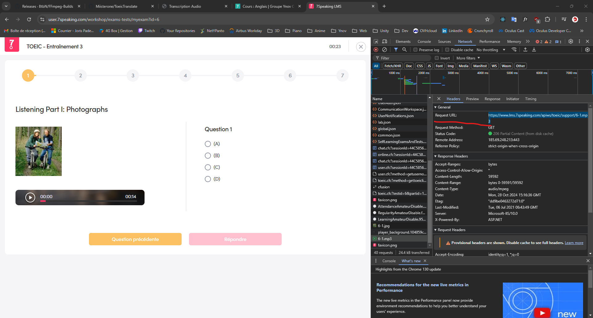
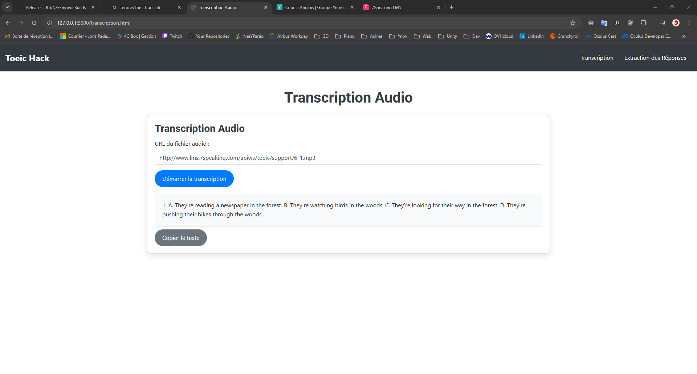

# Transcription et Extraction de Réponses TOEIC

Ce projet est une application web permettant de transcrire des fichiers audio et d'extraire les bonnes réponses d'un test TOEIC. Il utilise Node.js avec Express pour gérer le serveur et interagir avec un script Python pour la transcription audio.

## Fonctionnalités

- **Transcription Audio** : Saisissez l'URL d'un fichier audio et obtenez une transcription du fichier.
- **Extraction des Bonnes Réponses** : Saisissez l'URL d'une API TOEIC et extrayez automatiquement les bonnes réponses des questions.
- **Barre de Navigation** : Naviguez facilement entre la page de transcription et celle d'extraction des réponses.

## Structure du projet

```
transcription-serveur/
│
├── src/
│   ├── public/
│   │   ├── css/
│   │   │   └── styles.css
│   │   ├── extraction.html
│   │   └── transcription.html
│   └── server.js
├── transcribe.py
├── package.json
└── README.md
```

## Installation

### 1. Cloner le dépôt :

```bash
git clone https://github.com/votre-repo.git
```

### 2. Installer les dépendances Node.js et Python :

```bash
npm install
pip install -U openai-whisper
```

### 3. Installation de FFmpeg (obligatoire pour Whisper) :

Whisper dépend de FFmpeg pour traiter les fichiers audio. Suivez ces étapes pour installer FFmpeg sur votre système :

#### Pour Windows :
1. Téléchargez FFmpeg depuis le site officiel : [https://github.com/BtbN/FFmpeg-Builds/releases](https://github.com/BtbN/FFmpeg-Builds/releases)
2. Extrayez les fichiers téléchargés dans un dossier (par exemple `C:\ffmpeg`).
3. Ajoutez le chemin vers le dossier `bin` de FFmpeg à la variable d'environnement `PATH` :
   - Ouvrez les "Paramètres système avancés".
   - Cliquez sur "Variables d'environnement".
   - Modifiez la variable `PATH` et ajoutez le chemin complet vers le dossier `bin` (par exemple `C:\ffmpeg\bin`).
4. Redémarrez votre terminal et vérifiez l'installation avec la commande suivante :
   ```bash
   ffmpeg -version
   ```

#### Pour Linux :
```bash
sudo apt update
sudo apt install ffmpeg
```

#### Pour macOS :
```bash
brew install ffmpeg
```

### 4. Démarrer le serveur :

```bash
node src/server.js
```

### 5. Accéder à l'application :

Accédez à l'application via [http://localhost:3000](http://localhost:3000).

## Configuration supplémentaire

Dans le cas où FFmpeg n'est pas détecté correctement par Python, ajoutez manuellement son chemin dans votre script `transcribe.py` :

```python
import os
os.environ["PATH"] += os.pathsep + r'C:\path\to\ffmpeg\bin'  # Chemin vers FFmpeg
```

Remplacez `C:\path\to\ffmpeg\bin` par le chemin approprié sur votre système.

## Utilisation

- **Transcription** : Allez sur la page `Transcription` via la barre de navigation, entrez l'URL d'un fichier audio et cliquez sur "Démarrer la transcription".
- **Extraction des réponses** : Allez sur la page `Extraction des réponses`, entrez l'URL d'une API TOEIC et cliquez sur "Extraire les bonnes réponses".

## Exemple Extraction Des Réponses

Récupérer l'url de la requete puis mettre l'url dans **`URL de l'API`** sur la page Extraction


##  Exemple Transcription audio

Récupérer l'url de l'audio puis mettre l'url dans **`url du fichier audio`**


