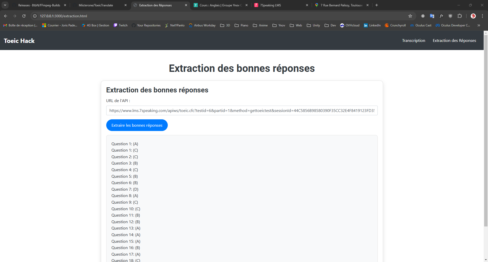

# Toiec Slayer

Ce projet est une application web permettant de transcrire des fichiers audio et d'extraire les bonnes réponses d'un
test TOEIC. Il utilise Node.js avec Express pour gérer le serveur et interagir avec un script Python pour la
transcription audio.

## Fonctionnalités

- **Audio To Text** : Saisissez l'URL d'un fichier audio et obtenez une transcription du fichier.
- **Extraction des Bonnes Réponses** : Saisissez l'URL d'une API TOEIC et extrayez automatiquement les bonnes réponses
  des questions.

## Installation

### 1. Cloner le dépôt :

```bash
git clone https://github.com/Miisterone/ToiecSlayer.git
```

### 2. Utiliser Docker pour Exécuter l'Application

**Pour les macs changer cette ligne dans le DockerFile:**

   ```docker
    RUN pip3 install torch==1.10.1+cpu torchvision==0.11.2+cpu torchaudio==0.10.1+cpu -f https://download.pytorch.org/whl/torch_stable.html
   ```
**Par  ce code:**
   ```docker
    RUN pip3 install torch torchvision torchaudio
   ```

1. **Construire l'image Docker** :
   ```bash
   docker build -t toiecslayer .
   ```

2. **Exécuter le conteneur Docker** :
   ```bash
   docker run -p 3000:3000 toiecslayer
   ```

Accédez à l'application via [http://localhost:3000](http://localhost:3000).

## Utilisation

- **Audio To Text** : Allez sur la page `Transcription` via la barre de navigation, entrez l'URL d'un fichier audio et
  cliquez sur "Démarrer la transcription".
- **Réponse quizz** : Allez sur la page `Extraction des réponses`, entrez l'URL d'une API TOEIC et cliquez sur "Extraire
  les bonnes réponses".

## Exemple Réponse quizz

Récupérer l'url de la requete qui contient "testid" puis mettre l'url dans **`URL de l'API`** sur la page
Extraction.<br>
Exemple
d'url : https://www.lms.7speaking.com/apiws/toeic.cfc?testid=3&partid=7&method=gettoeictest&sessionId=B67277F1542D4B6B3FD6872E588DA0CE5B948C9EA463D7E42D5E03FF79A05F79&languagetaught=ENG&LI=FRE




## Exemple Audio To Text

Récupérer l'url de l'audio (mp3) puis mettre l'url dans **`url du fichier audio`**


